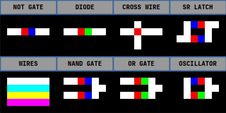

# LOTP Bitboard Core

This is a single header library to simulate and render Bitboard circuits on anywhere you want. 

## What is Bitboard Circuits

Bitboard Circuit is a bitmap logic circuit system that represented only with an image. Every pixel on that image can be a wire or a logic gate ether a not gate or diode. You can use 4 different wire colors to not make them connect even if they touching. Every gate represented with two pixels adjacent to each other, one pixel being always red to determine the input side and the other one is ether blue for not gate output or green for diode output.   



### Featues
  * Four Different Wires of Color
    * to not conduct electric between adjacent wires
  * Only Two Components
    * red pixel always an input of a Diode and Not Gate. 
    * Type of the component determined by the adjacent pixel. 
    * Blue is Not Gate and Green is Diode. 
  * Crossing Wires
    * Wires can cross each other if there is a red pixel on the overlap
    * Connected crossing wires color's can be different, this way you can connect two different wire colors each other


## How To Use
To use this library, simply include the `bitboard_core.h` header file in your project 
and make sure you add `#define BITBOARD_CORE_IMPLEMENTATION` before including it in **one** of your source files.

You must also implement these two callbacks in your project:

```c
// Usually called by `bb_render` to draw the bitboard to your renderer. 
// You can implement it to draw a pixel to your image buffer or directly to your renderer.
void bb_draw_pixel(uint16_t x, uint16_t y, uint32_t rgb8, void* image);

// Usually called by `new_bitboard` to read the initial state of the bitboard from your image buffer. 
// You can implement it to return the circuit image's pixel color at the given coordinates. 
uint32_t bb_get_pixel(uint16_t x, uint16_t y, void* image);
```

> [!NOTE]
> `image` is a pointer for your use to pass any necessary data to the callbacks, such as a pointer to your image buffer or renderer context.

Minimal integration example (raylib required):

```c
#include <stdlib.h>
#include <raylib.h>

#define BITBOARD_CORE_IMPLEMENTATION
#include "bitboard_core.h"

#define SCALE 10

void bb_draw_pixel(uint16_t x, uint16_t y, uint32_t rgb8, void* image) {
  Color color = GetColor(rgb8 << 8 | 0xFF); // Shift color to include alpha channel
  DrawRectangle(x*SCALE, y*SCALE, SCALE, SCALE, color); // Scale the pixel size for better visibility
}

uint32_t bb_get_pixel(uint16_t x, uint16_t y, void* image) {
  Image* ray_image = (Image*)image;
  Color color = GetImageColor(*ray_image, x, y);
  return ColorToInt(color) >> 8; // Shift color to remove alpha channel
}

void main() {
  // Initialize raylib window and load the circuit image
  Image ray_image = LoadImage("circuits/4BitClock.png");
  InitWindow(ray_image.width * SCALE, ray_image.height * SCALE, "Bitboard Core Test");

  bitboard_t* board = new_bitboard(&ray_image, ray_image.width, ray_image.height);
  
  // per frame / per step
  while(!WindowShouldClose()) {
    BeginDrawing();
    ClearBackground(BLACK);

    bb_tick(board);
    bb_render(board, &ray_image);

    EndDrawing();
  }

  free_bitboard(board);
}
```

Useful API calls:

* `bb_get_wire_at(board, x, y)` to read wire state
* `bb_set_wire_at(board, x, y, state)` to force wire state
* `board->reset_flag = 1` to reset circuit on next tick


## License
This project is licensed under the MIT License - see the [LICENSE](LICENSE) file for details
